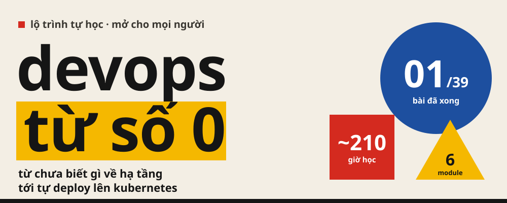
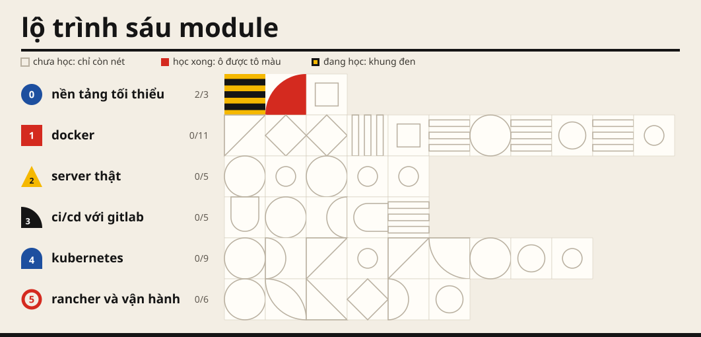

**[Đọc bản web đầy đủ](https://anhtuan2111.github.io/devops-self-learning/)**

# DevOps Self-Learning

> Học DevOps từ số 0, từ Docker tới Kubernetes

**Đích đến:** Tự đưa một ứng dụng Spring Boot lên Kubernetes, giữ nó chạy ổn định, và tự tìm ra lỗi khi nó hỏng.

| | |
|---|---|
| **Công cụ** | Spring Boot + PostgreSQL + Docker + GitLab CI + Kubernetes + Rancher |
| **Môi trường** | Windows 11 + WSL2 Ubuntu + Docker Desktop |
| **Quy mô** | 39 bài · 6 module · khoảng 162–264 giờ học |
| **Tiến độ** | 1/39 bài đã xong |

Mỗi bài đi từ một **vấn đề có thật**, tới **khái niệm**, rồi mới tới **công cụ**. Bài nào cũng có
một lab chạy thật, với một bước cố tình gây lỗi rồi tự sửa.

---

## Mục lục

### M0 · Nền tảng tối thiểu — Request, process và phòng lab

> Vừa đủ nền để Docker có nghĩa: một request đi qua những đâu, process là gì, và một máy Linux để thực hành.

| | # | Bài | Mục tiêu | Ước lượng | Đã học |
|---|---|---|---|---|---|
| xong | `00` | [Bản đồ toàn cảnh: một request đi từ browser tới code của bạn](lessons/00-ban-do-toan-canh/) | Vẽ lại được bằng trí nhớ toàn bộ đường đi của một HTTP request, và gọi tên được mọi thành phần trên đường đi đó. | 6–10 giờ | 24/09/2026 |
| đang học | `01` | [Máy tính, Hệ điều hành, Process: 'server' thật ra là cái gì](lessons/01-may-tinh-va-he-dieu-hanh/) | Hiểu server chỉ là một máy tính chạy 24/7, và mọi thứ bạn deploy cuối cùng đều là một process đang chạy. | 5–8 giờ | 25/09/2026 |
|  | `02` | [Phòng lab: WSL2, Docker Desktop và shell tối thiểu](lessons/02-phong-lab-wsl-docker/) | Có một máy Linux thật ngay trong Windows, Docker chạy được trong đó, và đủ vài lệnh shell để đi lại, đọc và sửa tệp. | 3–5 giờ | — |

### M1 · Docker — Đóng gói và chạy ứng dụng

> Đóng gói và chạy ứng dụng bằng Docker. Phần Linux và mạng cần tới được dạy ngay trong bài cần nó.

| | # | Bài | Mục tiêu | Ước lượng | Đã học |
|---|---|---|---|---|---|
|  | `03` | [Container đầu tiên: nó chỉ là một process bị cô lập](lessons/03-container-dau-tien/) | Chạy, xem, vào trong và xoá container thành thạo, và chứng minh được container chỉ là một process Linux bị giới hạn tầm nhìn. | 4–6 giờ | — |
|  | `04` | [Gọi được app trong container: port và listen address](lessons/04-port-va-publish/) | Không bao giờ còn mắc lỗi kinh điển: app chạy trong container nhưng từ ngoài không ai gọi được. | 3–5 giờ | — |
|  | `05` | [Image và registry: image được làm từ những lớp nào](lessons/05-image-va-registry/) | Hiểu một image gồm những gì, lấy về từ đâu, và đặt tên phiên bản thế nào cho đúng. | 3–5 giờ | — |
|  | `06` | [Dockerfile đầu tiên cho Spring Boot](lessons/06-dockerfile-dau-tien/) | Tự viết Dockerfile đóng gói project Spring Boot của bạn, và hiểu mỗi dòng tạo ra layer nào. | 4–6 giờ | — |
|  | `07` | [Dockerfile chuẩn production: nhỏ, không root, không bị giết vì hết bộ nhớ](lessons/07-dockerfile-production/) | Biến image Spring Boot thành một image nhỏ, chạy không bằng root, và không bị giết vì hết bộ nhớ. | 5–8 giờ | — |
|  | `08` | [Cấu hình và secret: một image, nhiều môi trường](lessons/08-cau-hinh-va-secret/) | Chạy cùng một image ở dev, staging và production chỉ bằng cách đổi cấu hình, và không bao giờ nhúng mật khẩu vào image. | 3–5 giờ | — |
|  | `09` | [Dữ liệu: volume, PostgreSQL và backup](lessons/09-volume-va-du-lieu/) | Không bao giờ mất dữ liệu vì xoá nhầm container, và khôi phục được database từ bản backup. | 4–6 giờ | — |
|  | `10` | [Docker network: container gọi nhau bằng tên](lessons/10-docker-network/) | Hiểu vì sao trong Docker bạn viết jdbc:postgresql://db:5432 thay vì localhost, và sửa được khi hai container không thấy nhau. | 3–5 giờ | — |
|  | `11` | [Docker Compose: cả hệ thống trong một file](lessons/11-docker-compose/) | Một lệnh dựng lên toàn bộ Spring Boot + PostgreSQL, tái lập được trên máy bất kỳ. | 5–8 giờ | — |
|  | `12` | [Container sống và chết thế nào: signal, restart, log](lessons/12-vong-doi-container/) | Container tắt êm không mất request đang xử lý, tự sống lại khi chết, và log không làm đầy ổ đĩa. | 4–6 giờ | — |
|  | `13` | [Gỡ lỗi container](lessons/13-go-loi-container/) | Có một quy trình chẩn đoán container hỏng thay vì thử bừa. | 4–7 giờ | — |

### M2 · Server thật — Deploy lên một máy Linux thật

> Tự tay đưa ứng dụng lên một server thật một lần, để biết các module sau đang tự động hoá những gì.

| | # | Bài | Mục tiêu | Ước lượng | Đã học |
|---|---|---|---|---|---|
|  | `14` | [SSH vào server](lessons/14-ssh-vao-server/) | Vào server an toàn bằng khóa, cấu hình một lần rồi chỉ cần gõ ssh tên-server. | 3–5 giờ | — |
|  | `15` | [Linux sinh tồn trên server](lessons/15-linux-tren-server/) | Đi lại trên một server lạ, tìm log, xem ổ đĩa, bộ nhớ và port mà không bị lạc. | 4–7 giờ | — |
|  | `16` | [Deploy thủ công bằng Compose lên server](lessons/16-deploy-thu-cong/) | Tự tay đưa hệ thống lên server thật một lần, và ghi lại chính xác từng bước để sau này tự động hoá. | 5–8 giờ | — |
|  | `17` | [Reverse proxy đứng trước ứng dụng](lessons/17-reverse-proxy/) | Đặt Nginx trước Spring Boot, và phân biệt được lỗi 502, 504, 413 do đâu mà ra. | 5–8 giờ | — |
|  | `18` | [Tên miền và HTTPS](lessons/18-ten-mien-va-https/) | Service có tên miền và ổ khóa HTTPS, chứng chỉ tự gia hạn mà không phải nhớ. | 4–7 giờ | — |

### M3 · CI/CD với GitLab — Từ git push tới server

> Tự động hoá bằng GitLab CI đúng những bước vừa làm tay ở module trước.

| | # | Bài | Mục tiêu | Ước lượng | Đã học |
|---|---|---|---|---|---|
|  | `19` | [CI/CD là quy trình, không phải công cụ](lessons/19-cicd-la-quy-trinh/) | Vẽ được pipeline mình cần trước khi viết dòng YAML nào, từ chính runbook của Bài 16. | 2–4 giờ | — |
|  | `20` | [GitLab CI cơ bản](lessons/20-gitlab-ci-co-ban/) | Pipeline đầu tiên trên GitLab: mỗi lần push, code tự được kiểm tra. | 4–6 giờ | — |
|  | `21` | [CI cho Spring Boot: build, test, cache](lessons/21-ci-spring-boot/) | Không merge một commit làm hỏng build hay gãy test. | 4–7 giờ | — |
|  | `22` | [Build và push image lên GitLab Container Registry](lessons/22-build-va-push-image/) | Mỗi commit trên nhánh chính sinh ra một image có phiên bản rõ ràng, sẵn sàng deploy. | 4–6 giờ | — |
|  | `23` | [Deploy tự động và rollback](lessons/23-cd-va-rollback/) | git push là server tự cập nhật, và quay về bản cũ trong dưới một phút. | 5–8 giờ | — |

### M4 · Kubernetes — Chạy container trên cả một cụm máy

> Chạy container trên nhiều máy cùng lúc. Mỗi khái niệm ở đây nối về một bài Docker đã học.

| | # | Bài | Mục tiêu | Ước lượng | Đã học |
|---|---|---|---|---|---|
|  | `24` | [Vì sao cần Kubernetes, và dựng một cụm nhỏ trên máy](lessons/24-vi-sao-kubernetes/) | Nói được Kubernetes giải quyết điều gì mà Compose trên một máy không làm được, và có một cụm để thực hành. | 4–7 giờ | — |
|  | `25` | [Pod và Deployment](lessons/25-pod-va-deployment/) | Chạy Spring Boot trên Kubernetes bằng Deployment, cập nhật phiên bản không gián đoạn, và quay lại khi hỏng. | 4–6 giờ | — |
|  | `26` | [Service và DNS trong cụm](lessons/26-service-va-dns-trong-cum/) | Các pod gọi nhau ổn định bằng tên, dù pod liên tục bị thay. | 4–6 giờ | — |
|  | `27` | [ConfigMap và Secret](lessons/27-configmap-va-secret/) | Tách cấu hình khỏi manifest, và biết Secret của Kubernetes bảo vệ được tới đâu. | 3–5 giờ | — |
|  | `28` | [Probe và giới hạn tài nguyên](lessons/28-probe-va-tai-nguyen/) | Pod chỉ nhận traffic khi app thật sự sẵn sàng, và không bị giết oan vì CPU hay bộ nhớ. | 5–8 giờ | — |
|  | `29` | [Dữ liệu trong Kubernetes: PVC và StatefulSet](lessons/29-du-lieu-trong-kubernetes/) | Chạy PostgreSQL trong cụm mà không mất dữ liệu khi pod bị thay, và biết khi nào không nên làm vậy. | 5–8 giờ | — |
|  | `30` | [Ingress và HTTPS trong cụm](lessons/30-ingress-va-https/) | Đưa service ra ngoài cụm bằng tên miền và HTTPS, chứng chỉ tự gia hạn. | 5–8 giờ | — |
|  | `31` | [Gỡ lỗi pod](lessons/31-go-loi-pod/) | Chẩn đoán có hệ thống mọi kiểu pod hỏng: Pending, CrashLoopBackOff, ImagePullBackOff, OOMKilled. | 4–7 giờ | — |
|  | `32` | [Helm, Job và CronJob](lessons/32-helm-job-cronjob/) | Đóng gói bộ manifest thành một chart dùng lại cho nhiều môi trường, và chạy tác vụ một lần hoặc theo lịch. | 5–8 giờ | — |

### M5 · Rancher và vận hành — Quản lý cụm, theo dõi, xử lý sự cố

> Quản lý cụm bằng Rancher, theo dõi, cảnh báo, xử lý sự cố, rồi tự dựng lại toàn bộ.

| | # | Bài | Mục tiêu | Ước lượng | Đã học |
|---|---|---|---|---|---|
|  | `33` | [Rancher: quản lý cụm qua một giao diện](lessons/33-rancher/) | Hiểu Rancher đứng ở đâu so với Kubernetes, và đọc được mọi thứ trên giao diện Rancher bằng ngôn ngữ kubectl. | 4–7 giờ | — |
|  | `34` | [Deploy lên cụm từ GitLab, và GitOps](lessons/34-deploy-len-cum-tu-gitlab/) | git push là service trên cụm tự cập nhật, qua pipeline hoặc qua GitOps. | 5–8 giờ | — |
|  | `35` | [Metric và dashboard](lessons/35-metric-va-dashboard/) | Có một dashboard trả lời được: service đang khoẻ hay yếu, và yếu ở đâu. | 5–8 giờ | — |
|  | `36` | [Log và cảnh báo](lessons/36-log-va-canh-bao/) | Tìm được nguyên nhân một lỗi xảy ra 3 ngày trước, và được báo trước khi người dùng phàn nàn. | 4–7 giờ | — |
|  | `37` | [Xử lý sự cố: quy trình khi mọi thứ đang cháy](lessons/37-xu-ly-su-co/) | Có một quy trình chẩn đoán theo tầng thay vì hoảng loạn thử mọi thứ. | 4–7 giờ | — |
|  | `38` | [Tổng kết: tự dựng lại toàn bộ](lessons/38-tong-ket/) | Chứng minh đã đạt đích đến: một service đi từ git push lên cụm, có probe, cấu hình, HTTPS, dashboard và cảnh báo, và tự giải thích được mọi mũi tên trong kiến trúc. | 5–8 giờ | — |

---

## Mỗi bài gồm

| Tệp | Dùng để |
|---|---|
| `index.html` | Bài giảng đầy đủ: giải thích, sơ đồ, bảng tra |
| `README.md` | Vở bài tập: các bước lab, danh sách tự kiểm tra |
| `notes.md` | Ghi chép: lỗi đã gặp, output thật |
| `lab/` | Các tệp đã viết trong bài |

## Tài liệu chính thức

| Chủ đề | Link |
|---|---|
| Docker — Get started | https://docs.docker.com/get-started/ |
| Docker — Dockerfile reference | https://docs.docker.com/reference/dockerfile/ |
| Docker Compose | https://docs.docker.com/compose/ |
| The Twelve-Factor App | https://12factor.net/ |
| Nginx — Beginner's Guide | https://nginx.org/en/docs/beginners_guide.html |
| Let's Encrypt / Certbot | https://certbot.eff.org/ |
| GitLab CI/CD | https://docs.gitlab.com/ci/ |
| Cú pháp `.gitlab-ci.yml` | https://docs.gitlab.com/ci/yaml/ |
| Kubernetes | https://kubernetes.io/docs/home/ |
| k3d — cụm Kubernetes học trên máy | https://k3d.io/ |
| Helm | https://helm.sh/docs/ |
| cert-manager | https://cert-manager.io/docs/ |
| Rancher | https://ranchermanager.docs.rancher.com/ |
| RKE2 | https://docs.rke2.io/ |
| Spring Boot Actuator | https://docs.spring.io/spring-boot/reference/actuator/index.html |
| Prometheus | https://prometheus.io/docs/introduction/overview/ |
| Grafana | https://grafana.com/docs/grafana/latest/ |
| Linux man pages | https://man7.org/linux/man-pages/ |
| Chuẩn Internet (RFC) | https://www.rfc-editor.org/ |

Thêm nguồn học bổ trợ ở tab Tài nguyên của [bản web](https://anhtuan2111.github.io/devops-self-learning/#tai-nguyen).
