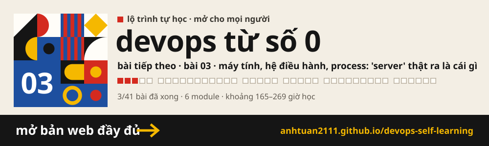

# DevOps Self-Learning

> Học DevOps từ số 0, từ Docker tới Kubernetes

DevOps là cách làm để chính người viết code đưa được nó lên server, giữ nó chạy ổn, và tìm ra lỗi khi nó hỏng.

**Đích đến:** Tự đưa một ứng dụng Spring Boot lên Kubernetes, giữ nó chạy ổn định, và tự tìm ra lỗi khi nó hỏng.

| | |
|---|---|
| **Công cụ** | Spring Boot + PostgreSQL + Docker + GitLab CI + Kubernetes + Rancher |
| **Môi trường** | Windows 11 + WSL2 Ubuntu + Docker Desktop |
| **Quy mô** | 41 bài · 6 module · khoảng 165–269 giờ học |
| **Tiến độ** | 4/41 bài đã xong |

Mỗi bài đi từ một **vấn đề có thật**, tới **khái niệm**, rồi mới tới **công cụ**. Bài nào cũng có
một lab chạy thật, với một bước cố tình gây lỗi rồi tự sửa.

---

## Mục lục

### M0 · Nền tảng tối thiểu — Request, process và phòng lab

> Vừa đủ nền để Docker có nghĩa: một request đi qua những đâu, process là gì, và một máy Linux để thực hành.

| # | Bài | Câu hỏi của bài | Ước lượng | Trạng thái |
|---|---|---|---|---|
| `00` | [Bản đồ toàn cảnh: một request đi qua chín chặng](lessons/00-ban-do-toan-canh/) | Từ lúc gõ một địa chỉ vào trình duyệt tới lúc code Spring Boot của bạn chạy, request đi qua những chặng nào, và chặng nào thật sự là code của bạn? | 3–5 giờ | xong 24/09/2026 |
| `01` | [IP, port, listen, firewall: vì sao gọi không tới](lessons/01-ip-port-listen-firewall/) | App chạy bình thường khi gọi bằng localhost:8080 trên chính máy mình, nhưng người khác gọi vào thì không được. Chặng mở kết nối hỏng ở đâu? | 3–5 giờ | xong 24/09/2026 |
| `02` | [Chẩn đoán theo chặng: nhìn lỗi biết chỗ hỏng](lessons/02-chan-doan-theo-chang/) | Kết nối tới được rồi mà trang vẫn báo 502, 500 hay 504. Lỗi đó do ai viết ra, và nó cho biết chặng nào đang hỏng? | 3–5 giờ | xong 24/09/2026 |
| `03` | [Máy tính, Hệ điều hành, Process: 'server' thật ra là cái gì](lessons/03-may-tinh-va-he-dieu-hanh/) | 502 nghĩa là phía sau Nginx không còn ai trả lời. Nhưng "app" thật ra là gì trên một máy chủ, vì sao nó có thể chết, và vì sao nó chết thì website sập? | 5–8 giờ | xong 03/10/2026 |
| `04` | [Phòng lab: WSL2, Docker Desktop và shell tối thiểu](lessons/04-phong-lab-wsl-docker/) | Server thật chạy Linux, còn mọi lab tới giờ chạy trên Windows. Làm sao có một máy Linux thật ngay trên máy mình, để thấy process, signal và lỗi đúng như trên server? | 3–5 giờ | đang học |

### M1 · Docker — Đóng gói và chạy ứng dụng

> Đóng gói và chạy ứng dụng bằng Docker. Phần Linux và mạng cần tới được dạy ngay trong bài cần nó.

| # | Bài | Câu hỏi của bài | Ước lượng | Trạng thái |
|---|---|---|---|---|
| `05` | Container đầu tiên: nó chỉ là một process bị cô lập | hello-world vừa chạy "trong một container". Container là một máy ảo nhỏ như WSL2, hay chỉ là một process như ở Bài 03? | 4–6 giờ | — |
| `06` | Gọi được app trong container: port và listen address | Container là một process có mạng riêng. Vậy làm sao gọi được app chạy bên trong nó từ trình duyệt trên máy mình? | 3–5 giờ | — |
| `07` | Image và registry: image được làm từ những lớp nào | Container chạy từ image. Image là gì, lấy về từ đâu, và vì sao tải image thứ hai lại nhanh hơn image đầu? | 3–5 giờ | — |
| `08` | Dockerfile đầu tiên cho Spring Boot | Tới giờ ta toàn chạy image người khác làm sẵn. Làm sao tự đóng gói chính app Spring Boot của mình thành image? | 4–6 giờ | — |
| `09` | Dockerfile chuẩn production: nhỏ, không root, không bị giết vì hết bộ nhớ | Image vừa build vừa nặng, chạy bằng root, và có thể bị kernel giết vì hết bộ nhớ. Làm sao cho nó đủ tốt để chạy production? | 5–8 giờ | — |
| `10` | Cấu hình và secret: một image, nhiều môi trường | Cùng một image phải chạy ở máy dev lẫn production, với database và mật khẩu khác nhau. Đưa cấu hình vào bằng cách nào mà không phải build lại, và không làm lộ mật khẩu? | 3–5 giờ | — |
| `11` | Dữ liệu: volume, PostgreSQL và backup | Xoá container PostgreSQL là dữ liệu mất sạch. Dữ liệu phải nằm ở đâu để sống lâu hơn container? | 4–6 giờ | — |
| `12` | Docker network: container gọi nhau bằng tên | App và PostgreSQL giờ là hai container. Vì sao app gọi localhost:5432 thì bị từ chối, và hai container gọi nhau bằng cách nào? | 3–5 giờ | — |
| `13` | Docker Compose: cả hệ thống trong một file | Mỗi lần dựng lại phải gõ tay hai container, một network, một volume và cả đống tham số. Làm sao dựng lại cả hệ thống bằng một lệnh? | 5–8 giờ | — |
| `14` | Container sống và chết thế nào: signal, restart, log | Hệ thống đã lên bằng một lệnh. Khi container bị dừng, bị giết hay tự chết, request đang xử lý ra sao, và ai dựng nó dậy? | 4–6 giờ | — |
| `15` | Gỡ lỗi container | Container chết ngay sau khi khởi động, hoặc chạy mà không ai gọi được. Có thứ tự kiểm tra cố định nào thay cho thử bừa không? | 4–7 giờ | — |

### M2 · Server thật — Deploy lên một máy Linux thật

> Tự tay đưa ứng dụng lên một server thật một lần, để biết các module sau đang tự động hoá những gì.

| # | Bài | Câu hỏi của bài | Ước lượng | Trạng thái |
|---|---|---|---|---|
| `16` | SSH vào server | Hệ thống đã chạy được trên máy mình. Để đưa nó lên một server ở xa, không màn hình, ta điều khiển server đó bằng cách nào cho an toàn? | 3–5 giờ | — |
| `17` | Linux sinh tồn trên server | Đã vào được một server lạ. Log nằm ở đâu, ổ đĩa và RAM còn bao nhiêu, ai đang giữ port nào, và một process được mở bao nhiêu file? | 4–7 giờ | — |
| `18` | Deploy thủ công bằng Compose lên server | Đã biết đi lại trên server. Đưa image và compose.yaml lên đó rồi chạy thật thì cần chính xác những bước nào? | 5–8 giờ | — |
| `19` | Reverse proxy đứng trước ứng dụng | App đang lộ thẳng port 8080 ra ngoài. Vì sao nên đặt Nginx đứng trước, và khi đã đặt thì 502, 504, 413 sinh ra từ đâu? | 5–8 giờ | — |
| `20` | Tên miền và HTTPS | Người dùng vẫn phải gõ địa chỉ IP, và trình duyệt báo "không an toàn". Làm sao có tên miền và ổ khoá HTTPS tự gia hạn? | 4–7 giờ | — |

### M3 · CI/CD với GitLab — Từ git push tới server

> Tự động hoá bằng GitLab CI đúng những bước vừa làm tay ở module trước.

| # | Bài | Câu hỏi của bài | Ước lượng | Trạng thái |
|---|---|---|---|---|
| `21` | CI/CD là quy trình, không phải công cụ | Deploy bằng tay theo runbook vừa chậm vừa dễ sót bước. Bước nào nên giao cho máy làm, và theo thứ tự nào? | 2–4 giờ | — |
| `22` | GitLab CI cơ bản | Đã vẽ được pipeline trên giấy. Viết nó ra thế nào để GitLab tự chạy mỗi lần push? | 4–6 giờ | — |
| `23` | CI cho Spring Boot: build, test, cache | Pipeline đã chạy. Làm sao nó chặn được một commit làm gãy build hay gãy test trước khi được merge? | 4–7 giờ | — |
| `24` | Build và push image lên GitLab Container Registry | Code đã được kiểm tra tự động. Làm sao mỗi commit tốt tự sinh ra một image có phiên bản rõ ràng, sẵn sàng deploy? | 4–6 giờ | — |
| `25` | Deploy tự động và rollback | Mỗi commit đã có image riêng. Làm sao server tự cập nhật sau mỗi lần merge, và quay về bản cũ thật nhanh khi bản mới hỏng? | 5–8 giờ | — |

### M4 · Kubernetes — Chạy container trên cả một cụm máy

> Chạy container trên nhiều máy cùng lúc. Mỗi khái niệm ở đây nối về một bài Docker đã học.

| # | Bài | Câu hỏi của bài | Ước lượng | Trạng thái |
|---|---|---|---|---|
| `26` | Vì sao cần Kubernetes, và dựng một cụm nhỏ trên máy | Mọi thứ đang chạy trên một server. Server đó chết thì sao, và khi một máy không còn đủ sức thì làm gì? | 4–7 giờ | — |
| `27` | Pod và Deployment | Đã có một cụm. Chạy app Spring Boot lên đó bằng gì, và vì sao pod bị xoá lại tự sinh ra? | 4–6 giờ | — |
| `28` | Service và DNS trong cụm | Pod liên tục bị thay, và mỗi lần thay lại đổi địa chỉ IP. Vậy app gọi PostgreSQL, và người ngoài gọi app, bằng địa chỉ nào? | 4–6 giờ | — |
| `29` | ConfigMap và Secret | Cấu hình và mật khẩu đang nằm cứng trong manifest. Đưa chúng vào pod bằng cách nào cho tách bạch và an toàn? | 3–5 giờ | — |
| `30` | Probe và giới hạn tài nguyên | Pod báo Running mà người dùng vẫn gặp lỗi, hoặc pod bị khởi động lại liên tục. Làm sao cụm biết app đã sẵn sàng thật, và cấp bao nhiêu tài nguyên là đủ? | 5–8 giờ | — |
| `31` | Dữ liệu trong Kubernetes: PVC và StatefulSet | Pod PostgreSQL bị thay là mất dữ liệu. Trong một cụm nhiều máy, dữ liệu sống ở đâu? | 5–8 giờ | — |
| `32` | Ingress và HTTPS trong cụm | Service mới gọi được từ trong cụm. Đưa app ra ngoài bằng tên miền và HTTPS thì làm thế nào? | 5–8 giờ | — |
| `33` | Gỡ lỗi pod | Pod kẹt ở Pending, CrashLoopBackOff hay ImagePullBackOff. Đọc gì, ở đâu để biết nguyên nhân? | 4–7 giờ | — |
| `34` | Helm, Job và CronJob | Bộ manifest đã lớn và lặp lại cho mỗi môi trường, lại còn những việc chạy một lần hay theo lịch như backup. Quản lý chúng thế nào? | 5–8 giờ | — |

### M5 · Rancher và vận hành — Quản lý cụm, theo dõi, xử lý sự cố

> Quản lý cụm bằng Rancher, theo dõi, cảnh báo, xử lý sự cố, rồi tự dựng lại toàn bộ.

| # | Bài | Câu hỏi của bài | Ước lượng | Trạng thái |
|---|---|---|---|---|
| `35` | Rancher: quản lý cụm qua một giao diện | Quản lý một cụm bằng kubectl và tệp YAML thì ổn. Khi có nhiều cụm và nhiều người cùng làm, nhìn và phân quyền thế nào? | 4–7 giờ | — |
| `36` | Deploy lên cụm từ GitLab, và GitOps | Đang deploy lên cụm bằng tay qua Rancher hoặc kubectl. Làm sao git push là cụm tự cập nhật, và không ai sửa tay được nữa? | 5–8 giờ | — |
| `37` | Metric và dashboard | Hệ thống đã tự deploy. Làm sao biết nó đang khoẻ hay đang yếu dần, trước khi người dùng gặp lỗi? | 5–8 giờ | — |
| `38` | Log và cảnh báo | Dashboard cho thấy đang có lỗi. Tìm nguyên nhân một lỗi từ ba ngày trước ở đâu, và làm sao được báo ngay mà không phải ngồi nhìn dashboard? | 4–7 giờ | — |
| `39` | Xử lý sự cố: quy trình khi mọi thứ đang cháy | Cảnh báo vừa kêu lúc nửa đêm. Làm gì, theo thứ tự nào, để tìm ra chỗ hỏng thay vì thử bừa? | 4–7 giờ | — |
| `40` | Tổng kết: tự dựng lại toàn bộ | Đã đi qua từng mảnh. Bạn có tự dựng lại được toàn bộ hệ thống từ một repo trống, và giải thích được từng mũi tên trong đó không? | 5–8 giờ | — |

---

## Mỗi bài gồm

| Tệp | Dùng để |
|---|---|
| `index.html` | Bài giảng đầy đủ: giải thích, sơ đồ, bảng tra |
| `README.md` | Vở bài tập: các bước lab, danh sách tự kiểm tra |
| `notes.md` | Ghi chép: lỗi đã gặp, output thật |
| `lab/` | Các tệp đã viết trong bài |

## Tài liệu chính thức

| Chủ đề | Link |
|---|---|
| Docker — Get started | https://docs.docker.com/get-started/ |
| Docker — Dockerfile reference | https://docs.docker.com/reference/dockerfile/ |
| Docker Compose | https://docs.docker.com/compose/ |
| The Twelve-Factor App | https://12factor.net/ |
| Nginx — Beginner's Guide | https://nginx.org/en/docs/beginners_guide.html |
| Let's Encrypt / Certbot | https://certbot.eff.org/ |
| GitLab CI/CD | https://docs.gitlab.com/ci/ |
| Cú pháp `.gitlab-ci.yml` | https://docs.gitlab.com/ci/yaml/ |
| Kubernetes | https://kubernetes.io/docs/home/ |
| k3d — cụm Kubernetes học trên máy | https://k3d.io/ |
| Helm | https://helm.sh/docs/ |
| cert-manager | https://cert-manager.io/docs/ |
| Rancher | https://ranchermanager.docs.rancher.com/ |
| RKE2 | https://docs.rke2.io/ |
| Spring Boot Actuator | https://docs.spring.io/spring-boot/reference/actuator/index.html |
| Prometheus | https://prometheus.io/docs/introduction/overview/ |
| Grafana | https://grafana.com/docs/grafana/latest/ |
| Linux man pages | https://man7.org/linux/man-pages/ |
| Chuẩn Internet (RFC) | https://www.rfc-editor.org/ |

Thêm nguồn học bổ trợ ở tab Tài nguyên của [bản web](https://anhtuan2111.github.io/devops-self-learning/#tai-nguyen).
