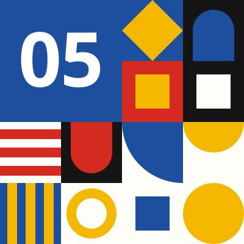

# Bài 05 — Image và registry: image được làm từ những lớp nào

> **Module M1** · Docker — Đóng gói và chạy ứng dụng
> Ước lượng: 3–5 giờ học (đọc trước, đối thoại, lab, ghi chép) · Trạng thái: `todo`

## Mục tiêu

Hiểu một image gồm những gì, lấy về từ đâu, và đặt tên phiên bản thế nào cho đúng.

## Cần đã học trước

- [Bài 03 · Container đầu tiên: nó chỉ là một process bị cô lập](../03-container-dau-tien/)

## Khái niệm sẽ gặp

- Layer: image là một chồng các lớp chỉ đọc
- Registry, repository, tag; Docker Hub
- Tag latest và vì sao không nên tin nó
- Digest: định danh không bao giờ đổi của một image
- docker pull, push, login, images, history, rmi
- Image chính thức và image lạ: rủi ro bảo mật

## Bài lab

Pull hai tag của cùng một image và xem history để thấy những layer được dùng chung. Cố tình pull một tag không tồn tại để gặp lỗi "manifest unknown", đọc lỗi và sửa.

## Tự kiểm tra

Học xong phải tự làm được, không nhìn tài liệu:

- [ ] Giải thích được vì sao pull tag thứ hai nhanh hơn tag đầu
- [ ] Nói được tag khác digest ở điểm nào, và khi nào cần digest
- [ ] Đọc được tên đầy đủ của một image: registry, repository, tag
- [ ] Kể được một rủi ro khi dùng image không rõ nguồn gốc

---

*Bài này chưa học. Nội dung đầy đủ sẽ được viết khi học tới bài này.*
